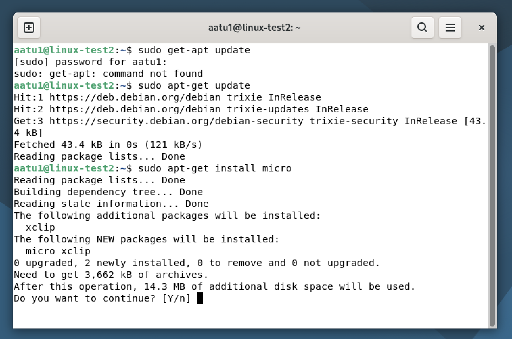
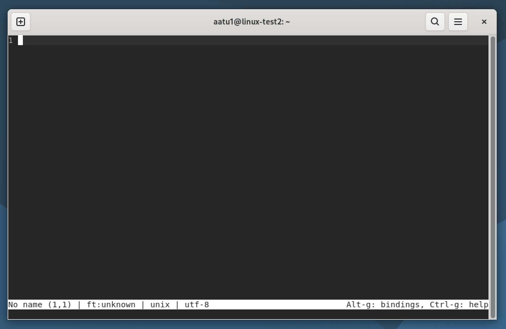
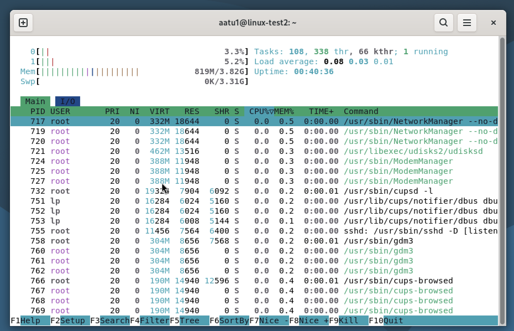
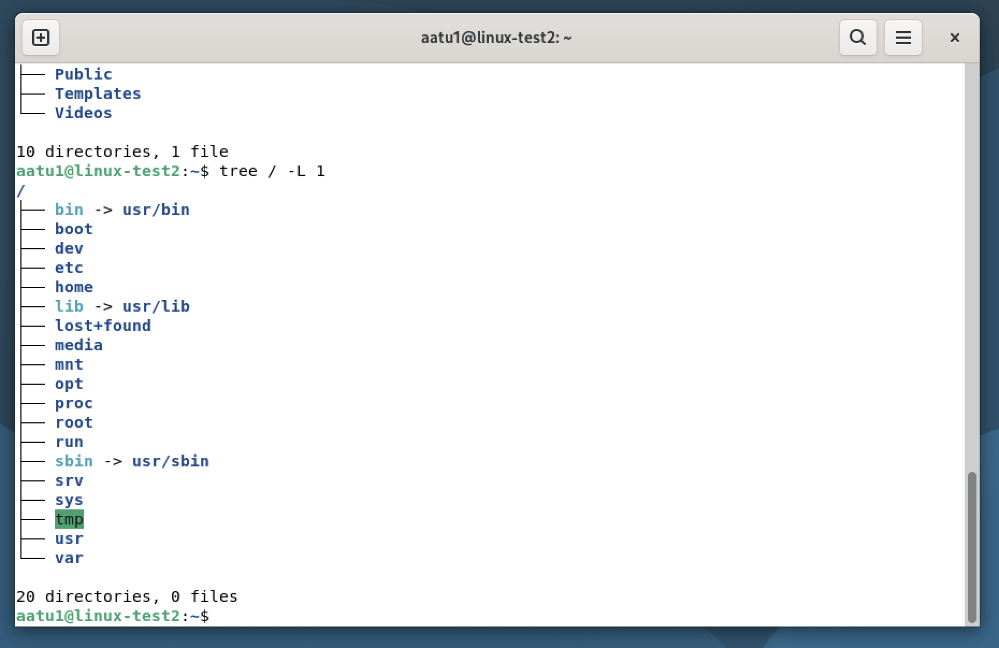
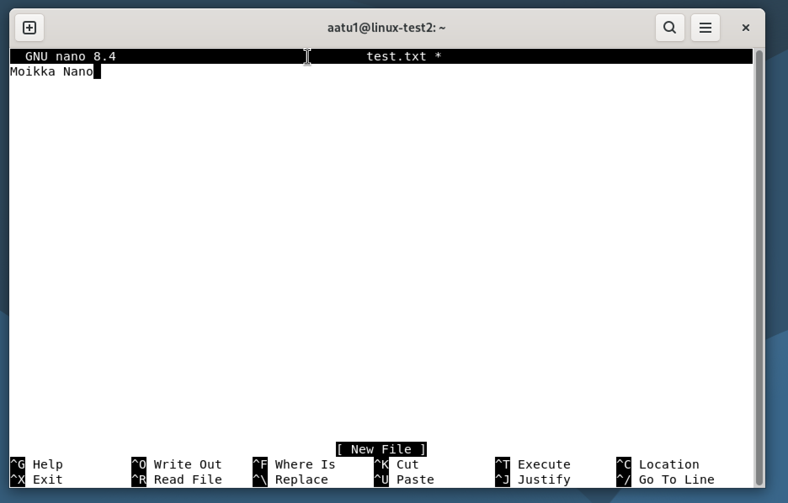
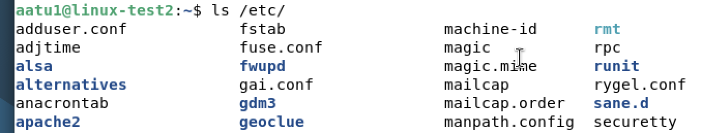
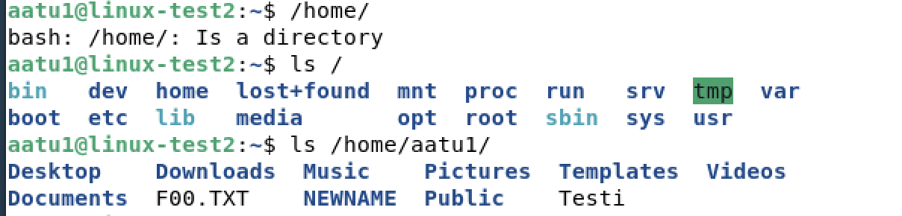
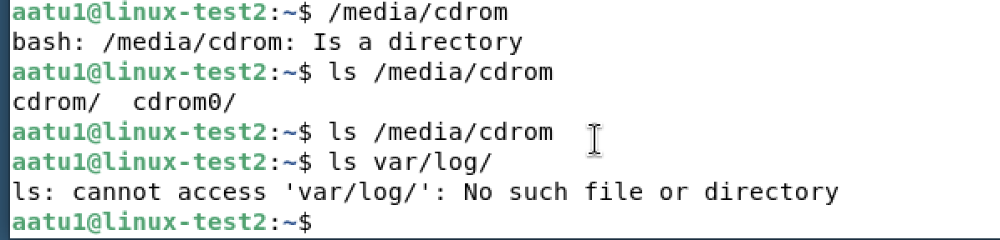
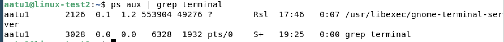

# h2

## Artikkeli: Command Line Basics Revisited
-Artikkelissa esitellään yleisimmät ja tärkeimmät komennot linuxin komentorivillä. Kuvassa kokeiltu itse komentoja.
 

-Artikkelin ohjeistus / komentojen avaaminen ei mielestäni selkeitä eikä ole tarkoitettu täysin nollasta aloittelevalle.

 ## Micro asennus

En muistanut salasanaa kun yritin sudo apt-get update. Seuraavaksi chatgpt auki ja ohjeita etsimään miten saan salasanan takaisin tai vastaavaa, no tämähän ei onnistu ja nyt yritin useamman kerran päästä GRUB-valikkoon (?) josta voisi mahdollisesti nollata salasanan, noh, varmaan lähemmäs 50 yritystä myöhemmin pääsin johonkin valikkoon. Sitten tuli ongelmia, että mistä saan "=" merkin, ei tule mistään näppäimestä eikä googlekaan osannut auttaa, noh jälleen varmaan 10 minuutin jälkein onnistui, kaikki näppäimet aivan sekaisin tällä hetkellä linuxissa ja ihan joka merkin kanssa kului turhaa aikaa. Noniin tekoälyn antamien ohjeiden mukaisesti kaikki tehty, mutta selviääkin, että nollasin ROOT salasanan (ehkä?), mitä ei oltu edes laitettu.. ja sudo salasanaa kysyy siis terminal edelleen.

Aikaa kulunut jo reilusti yli tunti tähän säätöön.. nyt vihdoin meikäpässi tajuaa kokeilla samaa salasanaa tuolla terminalissa kun kirjaudun linuxin GUI-malliin, ja sehän toimii.. noh oppiihan tässä säätäessä!

Ehkä oikea asennus aloitettu johannan sivuja tutkimalla löytyi oikeat komennot.
 

## Kolmen ohjelman asennus?

En osannut asentaa kolmea ohjelmaa samaan aikaan, vaikka löysinkin vastauksen heti kun olin ne erikseen asentanut, olisi toiminut sudo apt-get install micro htop tree nano.

Latasin neljä ohjelmaa, ja avatessa näyttävät tältä: MICRO, TUI, TREE ja NANO
 
  
   
    

## FHS

tässä vaiheessa hieman lisäongelmia, github sekoilee ja tästä katosi puolen tunnin kirjoitukset. Tein kuitenkin taas mielestäni todella epäselkeiden ohjeiden mukaan esimerkin important directories kohdasta. Kuvista näkyy polkuja, mutta en todellakaan ymmärtänyt tehtävänantoa joten en tiedä oliko tarkoitus tässä vain kokeilla eri komentoja. 

/home/ on kotikansio kaikille käyttäjille (?)
/home/aatu1/ minun kansio tai directory, pystyn tallentamaan tänne dataa
/etc/ sisältää teksti tiedostoja.
/media/ voi olla ulkoista mediaa esim USB-tikulla
/var/log/ logi tietoja

 
  
   

## GREP

Grep paljastui komennoksi jolla voi etsiä esim tekstitiedostosta tiettyä sanaa. Erilaisis komentoja Greppiinkiin lyyttyyi (-i, -c etc.)
 

 Tuossa etsin teksitiedostosta tiettyä sanaa. Muuta en osannut tehdä, eikä googlekaan selkeästi noviisia osannut neuvoa. Ymmärsin grepistä sen, että ainakin tekstiä voi etsiä erilaisista tiedostoista.

## Pipe

Pipe vaikuttaisi olevan todella hyödyllinen merkki. Hieman selvittelin taas googlella mitä kaikkea tällä voitaisiin tehdä ja tällaisen esimerkin sain aikaiseksi:
 

ps aux komennolla saadaa näkyviin käynnissä olevat prosessit, sitten kun laittaa | pipen väliin ja vaikka grep firefox niin saatiin näytille firefox sanan sisältävät rivit jossa näkyi prosessi. 

## Rauta

Komentorivi ei ymmärtänyt komentoa lshw joten asensin sen sudo apt install lshw. Tämä onnistui ja pääsin tutkimaan virtuaalikoneen rautaa / tietoja.

