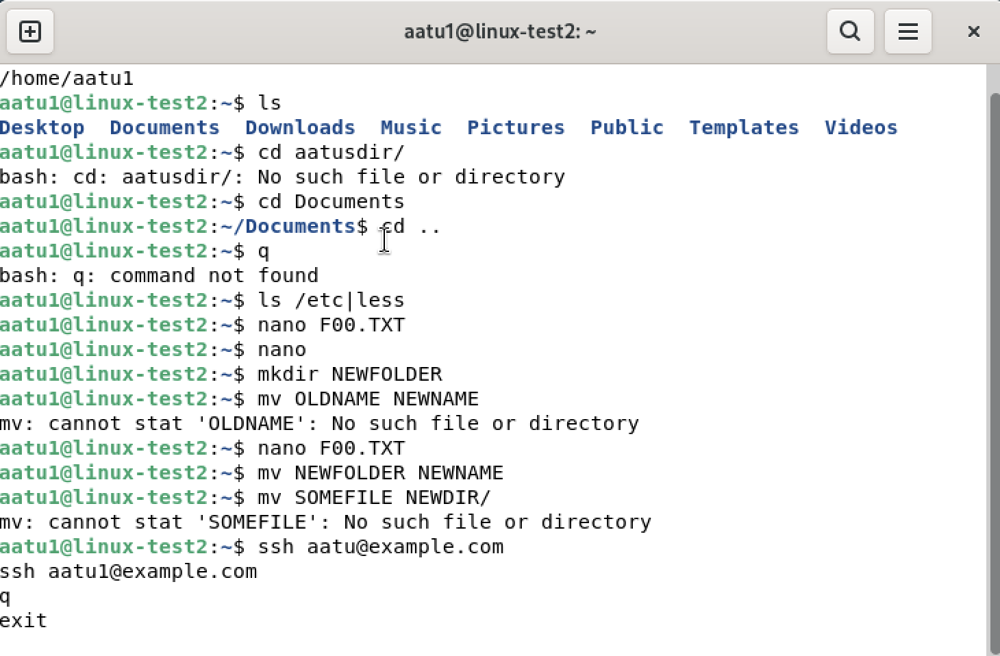

# h2

## Artikkeli: Command Line Basics Revisited
-Artikkelissa esitellään yleisimmät ja tärkeimmät komennot linuxin komentorivillä. Kuvassa kokeiltu itse komentoja.
 

-Artikkelin ohjeistus / komentojen avaaminen ei mielestäni selkeitä eikä ole tarkoitettu täysin nollasta aloittelevalle.

 ## Micro asennus

En muistanut salasanaa kun yritin sudo apt-get update. Seuraavaksi chatgpt auki ja ohjeita etsimään miten saan salasanan takaisin tai vastaavaa, no tämähän ei onnistu ja nyt yritin useamman kerran päästä GRUB-valikkoon (?) josta voisi mahdollisesti nollata salasanan, noh, varmaan lähemmäs 50 yritystä myöhemmin 
