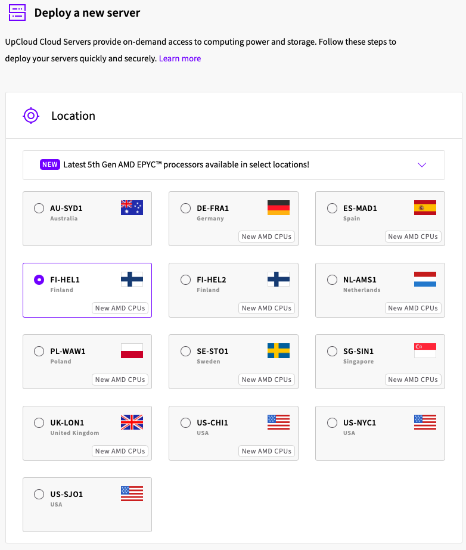
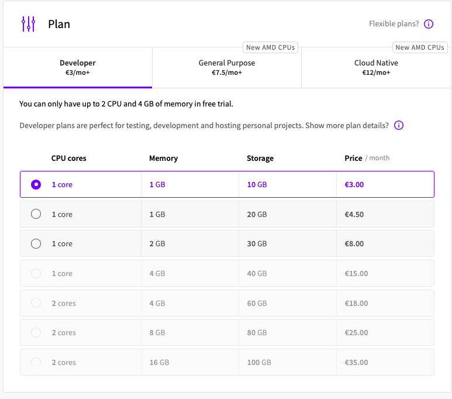
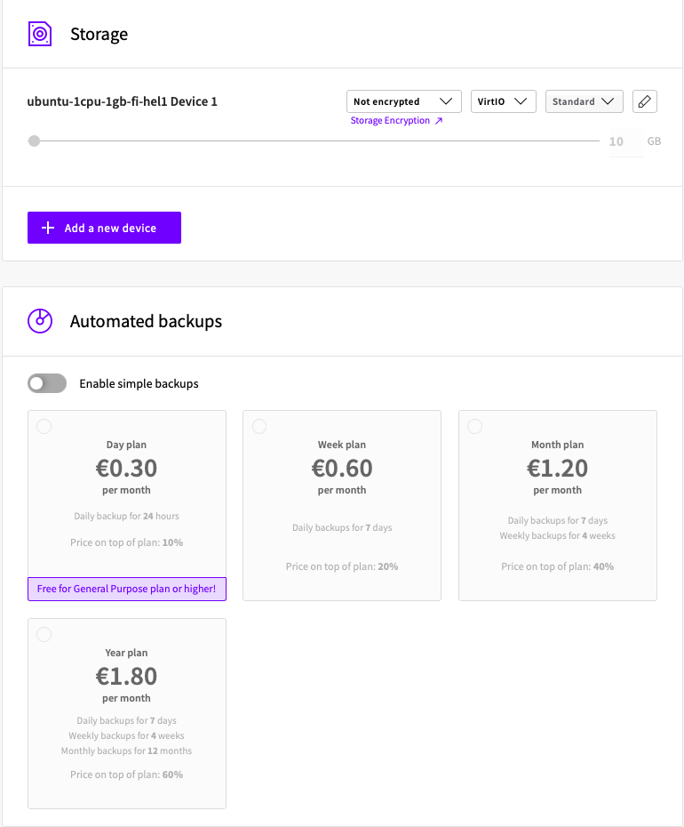
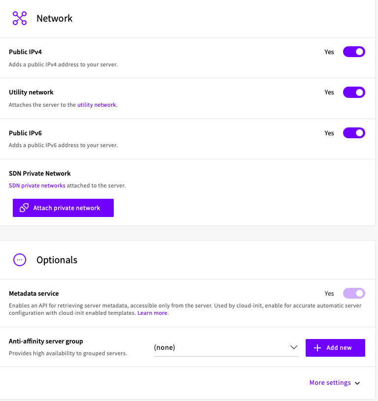
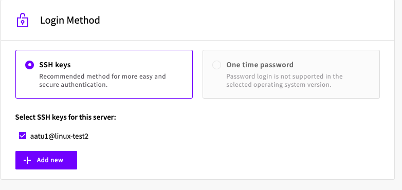
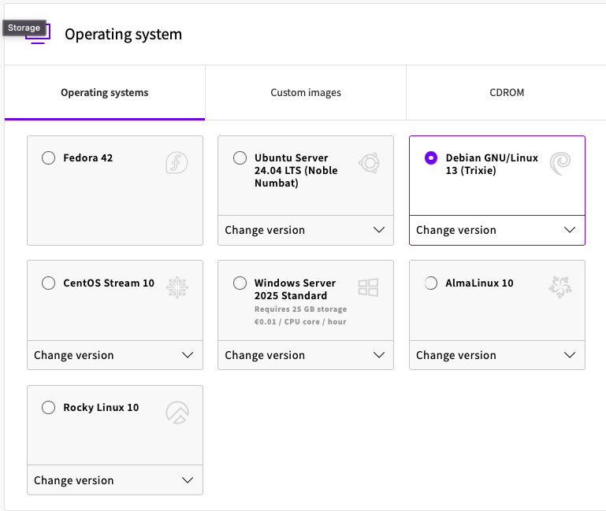

# H4 Tehtävät

## Artikkeli: Teoriasta käytäntöön pilvipalvelimen avulla (h4)
- Susanna Lehdon artikkeli käsitteli Tero Karvisen kurssia Linux-palvelimet, artikkelissa käydään kurssilla olevan viikkotehtävän vaiheet yksityiskohtaisesti läpi.
- Artikkelissa vuokrataan oikea virtuaalipalvelin sekä käydään sen asennus läpi. Susanna hankki palvelimen DigitalOceanilta, koska GitHub education tarjosi tätä vaihtoehtoa ilmaiseksi, muuten hän olisi valinnut suomalaisen palveluntarjoajan UpCloudin.
- Asennuksen jälkeen palvelin suojattiin palomuuurilla terminalin kautta
- Artikkelin loppuvaiheessa selviää myös, että Kiinasta oli yritetty ottaa yhteyttä Susannan pilvipalvelimeen ja tämä selvisi lokitiedoista.

## Artikkeli: First Steps on a New Virtual Private Server – an Example on DigitalOcean and Ubuntu 16.04 LTS
- Tero Karvisen artikkelissa vuodelta 2017 käsiteltiin lyhyesti kuinka uusi virtuaalipalvelin configuroidaan.
- Ohjeita mm. Tulimuurin reiän tekoon (komento $ sudo ufw allow 22/tcp, $ sudo ufw enable).
- Ohjeissä näytetään miten lisätään uusi käyttäjä esim. sudo oikeuksilla.

## Omat tehtävät
### Vuokraa pilvipalvelin
Tehtävän tarkoitus oli vuokrata oikea virtuaalipalvelin, vaihtoehtoja oli useita, mutta suosittiin suomalaista palveluntarjoajaa nimeltä UpCLoud.

Kun tunnukset sivustolle oltiin tehty, seuraavaksi oli vaiheena uuden serverin "pystytys". 

 
  
   
    
     
      

## Lähteet
https://susannalehto.fi/2022/teoriasta-kaytantoon-pilvipalvelimen-avulla-h4/
https://terokarvinen.com/2017/first-steps-on-a-new-virtual-private-server-an-example-on-digitalocean/
https://terokarvinen.com/linux-palvelimet/
https://upcloud.com
