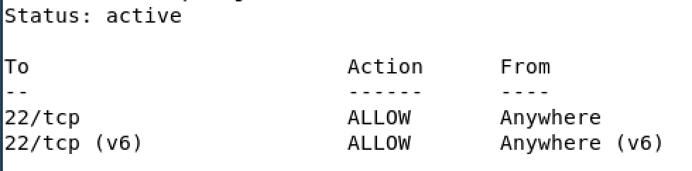

# H4 Tehtävät

## Artikkeli: Teoriasta käytäntöön pilvipalvelimen avulla (h4)
Susanna Lehdon artikkeli käsitteli Tero Karvisen kurssia Linux-palvelimet, artikkelissa käydään kurssilla olevan viikkotehtävän vaiheet yksityiskohtaisesti läpi.
 
Artikkelissa vuokrataan oikea virtuaalipalvelin sekä käydään sen asennus läpi. Susanna hankki palvelimen DigitalOceanilta, koska GitHub education tarjosi tätä vaihtoehtoa ilmaiseksi, muuten hän olisi valinnut suomalaisen palveluntarjoajan UpCloudin.
  
Asennuksen jälkeen palvelin suojattiin palomuuurilla terminalin kautta. Artikkelin loppuvaiheessa selviää myös, että Kiinasta oli yritetty ottaa yhteyttä Susannan pilvipalvelimeen ja tämä selvisi lokitiedoista. (Lehto 2024)

## Artikkeli: First Steps on a New Virtual Private Server – an Example on DigitalOcean and Ubuntu 16.04 LTS
Tero Karvisen artikkelissa vuodelta 2017 käsiteltiin lyhyesti kuinka uusi virtuaalipalvelin configuroidaan.

Ohjeita mm. Tulimuurin reiän tekoon (komento $ sudo ufw allow 22/tcp, $ sudo ufw enable).

Ohjeissä näytetään miten lisätään uusi käyttäjä esim. sudo oikeuksilla. (Karvinen 2025)

## Omat tehtävät
### Vuokraa pilvipalvelin
Tehtävän tarkoitus oli vuokrata oikea virtuaalipalvelin, vaihtoehtoja oli useita, mutta suosittiin suomalaista palveluntarjoajaa nimeltä UpCLoud.

Kun tunnukset sivustolle oltiin tehty, seuraavaksi oli vaiheena uuden serverin "pystytys". 

Ensimmäisenä vaiheena piti valita sijainti, tunnilla suositeltiin Suomea tai Euroopassa sijaitsevaa serveriä, koska yhteydet ovat nopeampia suomalaisille/eurooppalaisille käyttäjille. Jos suurin osa esim. yrityksen asiakkaista tulisi Amerikasta, niin voisi harkita USA:ssa sijaitsevaa serveriä. GDPR tulisi ottaa huomioon, jos serveri euroopan ulkopuolella.

Seuraava vaihe pilvipalvelimen käyttöönotossa oli valita plan, eli hieman lisätietoja siitä minkälaisen palvelimen haluua, prosessori, RAM-muisti ja muisti. Hinta vaihteli kuvassa näkyvällä tavalla. Tässä kohtaa valitsin ensimmäisen vaihtoehdon 3é/kk hinnalla (riittävä tällä hetkellä). Lisää muistia on helppo ostaa myöhemmin lisää.

Seuraan kohdan voi skippasin eli tämä Storage ja Automated backups.

Kohdassa Operating system, valitsin Debian GNU/linux 13 (trixie) koska se on kurssilla käytetty käyttöjärjestelmä. Muitakin vaihtoehtoja on, riippuen omista tarpeista.

Network kohdassa en tehnyt mitään koska palveluntarjoaja oli valmiiksi ruksittanut nämä, eikä lisämaksua tullut, joten siirryin seuraavaan kohtaan.

Login methodissa tein SSH keyt ja yhdistin ne tänne. SSH avaimet loin Virtuaalilinuxin terminalissa komennolla ssh-keygen, jonka jälkeen painoin enteriä muutaman kerran. Kopioin terminaalista public keyn rivin ja lisäsin sen UpCloudin sivulle.

Seuraavaksi painoin alhaalta deploy, ja homma oli valmis.

### Virtuaalipalvelimen alkutoimet
Seuraavaa ohjelmassa oli tehtävän annon mukaan pilvipalvelimen alkutoimet.

Ensimmäisenä menin virtuaalilinuxin terminaaliin ja otin etäyhteyden virtuaalipalvelimeen komennolla ssh root@195.12.12.12, eli root + @ + virtuaalipalvelimen IP-osoite, jonka näkee UpCloudin sivulta juuri tehdystä uudesta palvelimesta. 

Seuraavaksi lisäsin käyttäjän komennolla adduser aatu sudo, samalla tein käyttäjästä aatu sudo-käyttäjän. Seuraavaksi siirryin uuden käyttäjäni kotihakemistoon ja loin sinne .ssh kansion (mkdir -p /home/aatu/.ssh) ja annoin oikeudet (chmod 700 /home/aatu/.ssh). Seuraavaksi voin lisätä nano /home/aatu/.ssh/authorized_keys tiedostoon public keyn yhdelle riville. Public key löytyi virtuaalilinuxin .ssh kansiosta nimellä (id_ed255519.pub).

Seuraavaksi asetin oikeudet komennolla: chmod 600 /home/aatu1/.ssh/authorized_keys ja omistajuuden komennolla: chown -R aatu:aatu /home/aatu/.ssh

Seuraavaksi asensin palomuurin, ensiksi apt-get update ja sitten apt-get install ufw. Kun palomuuri on asennettu siihen täytyy tehdä reikä / avata portti ennen aktivointia. Komennolla ufw allow 22/tcp päästetään portin 22 liikenne läpi. Sitten vain aktivoidaan palomuuri komennolla ufw enable.

Tarkistin palomuurin tilan "ufw status" komennolla ja se näytti aktiivista.

Tässä vaiheessa avasin uuden terminaalin ja kokeilin kirjautua uudella käyttäjällä aatu@pilviIPosoite ja pääsin sisään ongelmitta. 

Nyt kun olin päässyt aatuna sisään, lukitsin ohjeiden mukaisesti root-tilin komennolla sudo usermod --lock root. Poistin myös rootin SSH-kirjautumisen. Eli menin sudoedit /etc/ssh/sshd_config ja sieltä vaihdoin kohdasta PermitRootLogin Yes -> no. Tallensin ja suljin editorin. Lopuksi käynnistin pavelimen uudelleen komennolla sudo service ssh restart.

### web-palvelin
Seuraavaksi tehtävänannossa oli web-palvelimen asennus.
Otin aatu käyttäjällä ssh yhteyden pilvipalvelimeen ja terminalissa komennolla sudo apt update päivitin järjestelmän ja asensin apache2 komennolla sudo apt-get install apache2.

testisivu korvattiin: suso nano /var/www/html/index.html ja sisällöksi voi laittaa mitä itse haluaa. Suljin ja tallensin. Sallin vielä portin 80 läpipääsyn palomuurissa, että sivu toimii selaimessa kaikilla käyttäjillä. Komento sudo ufw allow 80/tcp ja sudo ufw enable. Tunnilla käytiin läpi: echo "laser" | sudo tee /var/www/html/index.html
eli tuolla komennolla voidaan korvata etusivun sisältö, tässä tapauksessa laser sana tulisi sivulle näkyviin.

Teen vielä loppuu komennot sudo apt-get update ja sudo get-apt dist-upgrade. Lisäksi asensin paketin sudo apt install unattended-upgrades (en tiedä menikö nämä automaattisesti päälle) ja sudo apt-get install bash-completion. Lopuksi vielä systemctl reboot, niin varmasti kaikki on mennyt läpi.

Sivu toimii! (Sovelsin tätä hieman pidemmälle vielä raportin päätteeksi ja sivu näyttää nyt tältä :D)

## Lähteet
https://susannalehto.fi/2022/teoriasta-kaytantoon-pilvipalvelimen-avulla-h4/.

https://terokarvinen.com/2017/first-steps-on-a-new-virtual-private-server-an-example-on-digitalocean/.

https://terokarvinen.com/linux-palvelimet/.

https://upcloud.com.
